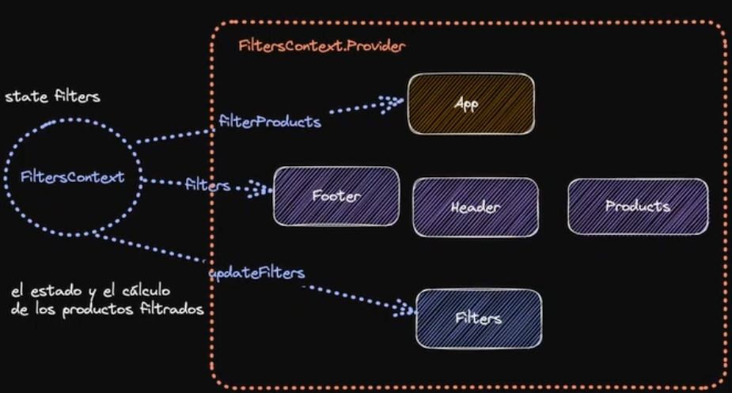

# good practice

Vamos a tener un estado general para los filtros

```jsx
const [filters, setFilters] = useState({ category: "all", minPrice: 0 });
```

Vamos a crear un método que nos permita filtrar los productos según
el filtro que tengamos.

filter es un método del array que nos va permitir filtrar un array.

Tenemos todo el array de producto y lo que hacemos es solo vamos a mostrar aquellos que complan estas 2 condiciones:

- que el precio de los productos sea mayor o igual al precio minimo que tenemos en los filtros, que por defecto es 0 para que aparescan todos y ademas tenemos que mirar que si el filter category es all, entonces lo mostrasmos independiente a la categoría que tengamos, pero si "NO" es old lo que vamos hacer es que los productos que tengan la categoría product.category sean la misma que el filters.category los vamos a mostrar, entonces esto devolvera true para aquellos productos que devuelvan estas condiciones.

Con esto ya tenemos el sistema de filtros.

```jsx
function App() {
  const [products, setfirst] = useState(initialProducts);
  const [filters, setFilters] = useState({ category: "all", minPrice: 0 });

  const filtersProducts = (product) => {
    return products.filter((product) => {
      return (
        (product.price >= filters.minPrice && filters.category === "all") ||
        product.category === filters.category
      );
    });
  };

  const filteredProducts = filtersProducts(products);

  return (
    <>
      <h1>Shopping Cart 🛒</h1>
      <Products products={filteredProducts} />
    </>
  );
}
```

Siempre es bueno hacer primero la lógica (la funcionalidad) luego ir probando, si en mock veo un precio del primero que es 30 y minPrice de estado agrego 50 va desaparecer y eso queire decir que ya esta funcionando. Puedo ir probando a mano luego aplico la UI.

Si aquí a mano aplicamos una category laptos, va a mostrar solo los laptos.

```js
const [filters, setFilters] = useState({ category: "lapto", minPrice: 0 });
```

## Vamos a crear el filtro del price con un rango

Si utlizas el un rango siempre tienes que mostrar de cuanto es el rango, para eso vas utilzar un estado que te va permitir saber donde esta y mostrarlo en el render

```jsx
import { useState } from "react";
import "../styles/Filters.css";

export default function Filters() {
  const [minPrice, setMinPrice] = useState(0);

  const handleChangeMinPrice = (event) => {
    setMinPrice(event.target.value);
  };

  return (
    <section className="filters">
      <div>
        <label htmlFor="price">Price from:</label>
        <input
          type="range"
          id="price"
          min="0"
          max="1000"
          onChange={handleChangeMinPrice}
        />
        <span>${minPrice}</span>
      </div>

      <div>
        <label htmlFor="category">Category</label>
        <select id="category">
          <option value="all">all</option>
          <option value="laptops">Laptops</option>
          <option value="smartphone">Celphones</option>
        </select>
      </div>
    </section>
  );
}
```

siempre coloca el valor después despues del input para no tener brincos saltos en la UI.

Que tenemos que hacer para que esto funcione, nos vamos al app y el setFilters se lo tenemos que pasar al header


El Filters es el que quiere leer realmente el estado de los filtros, no solo leerlo si no también actualizarlo.

- Por eso tenemos que pasar el setFilters de la App y del Header al Filters.

## Esto se le conoce en react como prop driling

Es como si con un taladro estas pasando hacia abajo unas props para que pueda funcionar algo.

No ocupes useMemo y useCallback por defecto siempre tienes que ver si hay problemas de rendimiento y con la cantidad de data que estas trabajando, analisar si el calculo es costoso o no. El coste que tiene useMemo puede ser mayor que los beneficios que nos da.

```jsx
import { useState } from "react";
import "../styles/Filters.css";

export default function Filters({ onChange }) {
  const [minPrice, setMinPrice] = useState(0);

  const handleChangeMinPrice = (event) => {
    setMinPrice(event.target.value);
    //algo esta mal
    //hay 2 fuentes de la verdad
    onChange((prevState) => ({
      ...prevState,
      minPrice: event.taget.value,
    }));
  };

  const handleChangeCategory = (event) => {
    //esto esta mal
    onChange((prevState) => ({
      ...prevState,
      category: event.target.value,
    }));
  };

  return (
    <section className="filters">
      <div>
        <label htmlFor="price">Price</label>
        <input
          type="range"
          id="price"
          min="0"
          max="1000"
          onChange={handleChangeMinPrice}
        />
        <span>${minPrice}</span>
      </div>

      <div>
        <label htmlFor="category">Category</label>
        <select id="category" onChange={handleChangeCategory}>
          <option value="all">all</option>
          <option value="laptops">Laptops</option>
          <option value="smartphone">Celphones</option>
        </select>
      </div>
    </section>
  );
}
```

vemos que onChange es la props de setFilters que pasamos desde App, este es un error muy común icluso de seniors en react.

## Qué es lo mas difícil de usar react?

Es saber usar bien react

```jsx
import { useState } from "react";
import "../styles/Filters.css";

export default function Filters({ onChange }) {
  const [minPrice, setMinPrice] = useState(0);

  const handleChangeMinPrice = (event) => {
    setMinPrice(event.target.value);
    //algo esta mal

    onChange((prevState) => ({
      ...prevState,
      minPrice: event.taget.value,
    }));
  };

  const handleChangeCategory = (event) => {
    //estamos pasando la función de actualizar estado
    //nativa de react a un componente hijo
    onChange((prevState) => ({
      ...prevState,
      category: event.target.value,
    }));
  };

  return (
    <section className="filters">
      <div>
        <label htmlFor="price">Price</label>
        <input
          type="range"
          id="price"
          min="0"
          max="1000"
          onChange={handleChangeMinPrice}
        />
        <span>${minPrice}</span>
      </div>

      <div>
        <label htmlFor="category">Category</label>
        <select id="category" onChange={handleChangeCategory}>
          <option value="all">all</option>
          <option value="laptops">Laptops</option>
          <option value="smartphone">Celphones</option>
        </select>
      </div>
    </section>
  );
}
```

aquí lo que tienes que saber es que el contrato que espera este onChange, es el del state. Esta cosas son las que vas querer evitar para crear una pequeña abstracción, entre el componente padre y el componente hijo, por que si no el contrato que tienes aquí es un estado de react

```jsx
onChange((prevState) => ({
  ...prevState,
  minPrice: event.taget.value,
}));
```

y no debería que por que saberlo si al final lo que necesitamos es algo mas concreto.

```jsx
const handleChangeMinPrice = (event) => {
  //algo esta mal
  setMinPrice(event.target.value);
  onChange((prevState) => ({
    ...prevState,
    minPrice: event.target.value,
  }));
};

const handleChangeCategory = (event) => {
  //estamos pasando la función de actualizar estado
  //nativa de react a un componente hijo
  onChange((prevState) => ({
    ...prevState,
    category: event.target.value,
  }));
};
```

El error es que, luego ese contrato lo tienes que cambiar en muchos sitios.

## useReducer que es una forma distinta a useState para manejar el estado

## useId

para no cometer errores con la id de tenerla en cualquier sitio de forma manual.

```jsx
<section className="filters">
  <div>
    <label htmlFor="price">Price</label>
    <input
      type="range"
      id="price"
      min="0"
      max="1000"
      onChange={handleChangeMinPrice}
    />
    <span>${minPrice}</span>
  </div>

  <div>
    <label htmlFor="category">Category</label>
    <select id="category" onChange={handleChangeCategory}>
      <option value="all">all</option>
      <option value="laptops">Laptops</option>
      <option value="smartphone">Celphones</option>
    </select>
  </div>
</section>
```

Como vemos en estos input es muy facíl que te equivoques, qués es lo que tienes que utlizar
en lugar de usar la id manualmente, react tiene un HOOK que se llama **useId** justamente lo
que te genera es un identificador unico, siempre va a ser el mismo y ademas funciona con server side rendering,
En nuestro caso no estamos usando Next js, pero igual podemos aplicar al mismo caso.

## ¿ Por qué ? esto funciona

```jsx
import { useId, useState } from "react";
import "../styles/Filters.css";

export default function Filters({ onChange }) {
  const [minPrice, setMinPrice] = useState(0);
  const minPriceFilteredId = useId();
  const categoryFilterId = useId();

  const handleChangeMinPrice = (event) => {
    //algo esta mal
    setMinPrice(event.target.value);
    onChange((prevState) => ({
      ...prevState,
      minPrice: event.target.value,
    }));
  };

  const handleChangeCategory = (event) => {
    //estamos pasando la función de actualizar estado
    //nativa de react a un componente hijo
    onChange((prevState) => ({
      ...prevState,
      category: event.target.value,
    }));
  };

  return (
    <section className="filters">
      <div>
        <label htmlFor={minPriceFilteredId}>Price</label>
        <input
          type="range"
          id={minPriceFilteredId}
          min="0"
          max="1000"
          onChange={handleChangeMinPrice}
        />
        <span>${minPrice}</span>
      </div>

      <div>
        <label htmlFor={categoryFilterId}>Category</label>
        <select id={categoryFilterId} onChange={handleChangeCategory}>
          <option value="all">all</option>
          <option value="laptops">Laptops</option>
          <option value="smartphones">Celphones</option>
        </select>
      </div>
    </section>
  );
}
```

Lo que esta diciendo react es voy ponerle un identificador al componente que puede ser
cualquier cosa, numero letra, etc...


Este orden siempre va ser el mismo, tanto en el servidor como en el cliente, como index esto
no sirve

una cosa cuando usas map el identificador único es para ese elemento, en el filter es distinto
orden de llamada para ese elemento.

useId tenerlo en cuenta para renderizado con filtros.

Tiene sentido todo esto, si esto es un estado se vuelve a generar el estado, entonces se vuelve a renderizar el componente y renderizarse el componente se vuelve ejecutar esta linea de aqui

```jsx
const filteredProducts = filtersProducts(products);
```

```jsx
function App() {
  const [products] = useState(initialProducts);
  const [filters, setFilters] = useState({ category: "all", minPrice: 0 });

  const filtersProducts = (product) => {
    return products.filter((product) => {
      return (
        (product.price >= filters.minPrice && filters.category === "all") ||
        product.category === filters.category
      );
    });
  };

  const filteredProducts = filtersProducts(products);

  return (
    <>
      <Header changeFilters={setFilters} />
      <Products products={filteredProducts} />
    </>
  );
}

export default App;
```

## useContext ta va permitir tener un nuevo contexto en react

Lo unico que hemos hecho es extrear la lógica del componente App sobre los filtro en un customHook

```js
export function useFilter() {
  const [filters, setFilters] = useState({ category: "all", minPrice: 0 });

  const filtersProducts = (product) => {
    return products.filter((product) => {
      return (
        (product.price >= filters.minPrice && filters.category === "all") ||
        product.category === filters.category
      );
    });
  };

  return { filtersProducts, setFilters };
}
```

como funciona el hook por dentro ya no importa tanto, lo único que nos interesa es que nos traiga una forma de filtrar los productos a base de los filtros y una forma de actualizar los filtros.

Vemos que la forma de pasar el stado y props es muy desordenada sería mejor pasar esto dentro de los componentes donde solo la necesitamos.

Para solucionar esto vamos a crear el contexto, aquellos componentes que quieran el estado.

El estado y el cálculo lo vamos a tener el contexto el de filters. Vamos a desacoplar toda la lógica y la va leer el componente que la necesite.


**El contexto** está totalmente separado de nuestro árbol de componentes y puede leer de forma separada, pero como consigues realmente leer de aquí.

Para eso tenemos que envolver toda nuestra App con un filter provider, porque si no por defecto no tiene acceso.

Debemos seguir 3 pasos:

- Crear el contexto
- Proveer el contexto
- Consumir el contexto

## Provider


```jsx
export const FiltersContext = createContext();

//2.provide the context to provide the context

export function FiltersProviders({ children }) {
  return (
    <FiltersContext.Provider
      value={{
        category: "all",
        minPrice: 0,
      }}
    >
      {/* 3. define the value of initial state */}
      {children}
    </FiltersContext.Provider>
  );
}
```

Por ahora iniciamos con este value, necesitamos sacar diferente información para componente específico.



Necesitamos envolver toda nuestra App para que funcione.
Ya lo hemos creado y proveído el contexto. Pero nos falta consumirlo.

## vamos a consumirlo

Aquí le estamos pasando el contexto que tenemos que consumir

```jsx
import React from "react";
import ReactDOM from "react-dom/client";
import App from "./App";
import { FiltersProviders } from "./context/filter";

ReactDOM.createRoot(document.getElementById("root")).render(
  <FiltersProviders>
    <App />
  </FiltersProviders>
);
```

```jsx
import { createContext } from "react";

//1.Este es que tenemos que consumir
export const FiltersContext = createContext();

//2.Este es el que nos provee de acceso al contexto

export function FiltersProviders({ children }) {
  return (
    <FiltersContext.Provider
      value={{
        category: "all",
        minPrice: 0,
      }}
    >
      {/* 3. define the value of initial state */}
      {children}
    </FiltersContext.Provider>
  );
}
```

Puedo existir un contexto que sea estático, pues tener un contexto para en theme, el contexto es una forma de inyección de dependencias, no es solo para hacer estados globales

ya estamos consumiendo el contexto, el contexto que estamos consumiendo es estático.


Vamos a crear un estado para que el contexto puedo controlar
esto. Como el contexto esta fuera de ese componente vamos a tener un stado para ese solo contexto.

```jsx
import { createContext, useState } from "react";

//1.create the context
export const FiltersContext = createContext(); //solo se crea una vez

//2.provide the context to provide the context

export function FiltersProviders({ children }) {
  const [filters, setFilters] = useState({
    category: "all",
    minPrice: 0,
  });

  return (
    <FiltersContext.Provider value={{ filters, setFilters }}>
      {/* 3. define the value of initial state */}
      {children}
    </FiltersContext.Provider>
  );
}
```

Ya no queremos solamente el valué sino el state y setFilters, con los pocos cambios que hemos hecho tenemos
un estado global.

Contex esta pensado para estado -> que cambien con poca
Frecuencia o que sea muy pequeños.

ahora vamos a evitar el prop driling

```jsx
import { useId, useState } from "react";
import { useFilter } from "../hooks/useFilter";
import "../styles/Filters.css";

export default function Filters() {
  const { setFilters } = useFilter(); //trear el state directamente de los filtros, primera fuente de la verdad
  const [minPrice, setMinPrice] = useState(0); //segunda fuente de la verdad
  const minPriceFilteredId = useId();
  const categoryFilterId = useId();

  console.log({
    minPriceFilteredId,
    categoryFilterId,
  });

  const handleChangeMinPrice = (event) => {
    //algo esta mal
    setMinPrice(event.target.value);
    setFilters((prevState) => ({
      ...prevState,
      minPrice: event.target.value,
    }));
  };

  const handleChangeCategory = (event) => {
    //estamos pasando la función de actualizar estado
    //nativa de react a un componente hijo
    setFilters((prevState) => ({
      ...prevState,
      category: event.target.value,
    }));
  };

  return (
    <section className="filters">
      <div>
        <label htmlFor={minPriceFilteredId}>Price</label>
        <input
          type="range"
          id={minPriceFilteredId}
          min="0"
          max="1000"
          onChange={handleChangeMinPrice}
        />
        <span>${minPrice}</span>
      </div>

      <div>
        <label htmlFor={categoryFilterId}>Category</label>
        <select id={categoryFilterId} onChange={handleChangeCategory}>
          <option value="all">all</option>
          <option value="laptops">Laptops</option>
          <option value="smartphones">Celphones</option>
        </select>
      </div>
    </section>
  );
}
```

la Lógica la tenemos separada de los propios filters

## Error común en react

2 fuentes de la verdad el price de la UI no es el mismo que tenemos en nuestro contexto porque esto es un estado local

```jsx
const [minPrice, setMinPrice] = useState(0); // esto es local
```

y tenemos el filtro del minPrice en el estado global, es como que tenemos el mismo estado repetido 2 veces. En react solo
tienes que tener solo una fuente de la verdad. EL problema que al tener 2 fuentes de la verda no sabes por cual guiarte,
Nuetra UI no es viable, entonces como evitamos este problema

- nos vamos a guiar de los filtros globales

ahora sí lo tenemos totalmente sincronizado, solamente una fuente de la verdad

## Vamos a crear el contexto del Carro de compra

El carrito es importante que sea un estado global porque aparecerán fijo en la parte superior, pero también los botones tendrán que cambiar y actualizar el aside con el detalle del producto agregado al carrito.

## Cómo añadimos un producto al carrito de manera sencilla

```jsx
const addToCart = (product) => {
  setCart([...cart, product]);
};
```

lo que podemos hacer es checkar si el producto ya se encuentra en el carrito.

```jsx
const productInCartIndex = cart.findIndex((item) => item.id === product.id);
```

Lo que podemos hacer en el caso que ya este.

Vamos a buscar en el carrito el index de ese item donde el item.id sea igual al producto que estamos intentando añadir.

Vamos a utilizar el structoreClone(cart) hace copia profunda de los arrays y de los objetos

por lo tanto, aquí tienes un carrito nuevo

```jsx
//this is a form one way
if (productInCartIndex >= 0) {
  const newCart = structuredClone(cart);
  newCart[productInCartIndex].quantity += 1;
  return setCart(newCart);
}
```

**Ya sabes que en el estado no puedes mutar el estado**

lo que puedes hacer justamente es recuperar el index que tenemos de productInCartIndex e incrementar la cantidad, que este no es parte del state, la copia la estamos modificando.
Este es una forma.

¿por qué no usar spread operator? por que no es una copia profunda es una copia superficial.

como el producto no está en el carrito lo inicializamos con la cantidad de 1

```jsx
setCart((prevState) => [
  ...prevState,
  {
    ...product,
    quantity: 1,
  },
]);
```

ahora que tenemos el contexto tenemos que crear un hook para poder leer el contexto, vamos a crear un useCart que va a ser un custom hook.

Una cosa que se pueden hacer el los custom hook que consumen un contexto y buena práctica, es el hecho de que context es undefined

## Por qué ocupamos prevState

```jsx
import { createContext, useState } from "react";

export const CartContext = createContext();

export function CartProvider({ children }) {
  const [cart, setCart] = useState([]);

  const addToCart = (product) => {
    //check if the product is already in the cart
    const productInCartIndex = cart.findIndex((item) => item.id === product.id);

    if (productInCartIndex >= 0) {
      const newCart = structuredClone(cart);
      newCart[productInCartIndex].quantity += 1;
      return setCart(newCart);
    }

    //the product is not in the cart
    setCart((prevState) => [
      ...prevState,
      {
        ...product,
        quantity: 1,
      },
    ]);
  };

  const removeFromCart = (product) => {
    setCart(cart.filter((item) => item.id !== product.id));
    setCart((prevState) => prevState.filter((item) => item.id !== product.id));
  };
  const clearCart = () => {
    setCart([]);
  };
  return (
    <CartContext.Provider
      value={{ cart, addToCart, removeFromCart, clearCart }}
    >
      {children}
    </CartContext.Provider>
  );
}
```

cuando tenemos la actualización del estado:

```jsx
setCart(cart.filter((item) => item.id !== product.id));
```

esto aveces puede tener un array condition y accede exactamente al ultimo valor que puede tener el state, es mejor y buena práctica hacerlo con la función, **la función recibe como primer parámetro justamente el valor anterior del estado y partir de ese valor devolvés el nuevo valor que tiene que tener ese estado**

vamos a componente Cart

```jsx
function CartItem({ thumnail, price, title, quantity, addToCart }) {
  return (
    <li>
      
      <div>
        <strong>{title}</strong> - ${price}
      </div>
      <footer>
        <small onClick={addToCart}>Qty: {quantity}</small>
        <button>*</button>
      </footer>
    </li>
  );
}
```

addToCart quiero que añada ese producto entonces se lo paso como una función que se va ejecutar cada vez que le den click, lo que estamos haciendo es crear una función que se la pasamos como props para añadir específicamente ese producto, no hace falta que el addToCart como global sin necesidad de del parámetro producto pase también a CartItem, quien añade
al carrito es el padre.

```jsx
<button onClick={clearCart}>
  <ClearCartIcon />
</button>
```

aquí le estamos pasando la referencia de la función no la ejecución y además no recibe ningún paramentro, también puede ser una mala práctica si tiene un parámetro opcional, estas realmente controlando lo que se ejecuta en la función

```jsx
<button onClick={() => clearCart()}>
  <ClearCartIcon />
</button>
```

si lo entiendes así todo está bien, no pasa nada. Las funciones son de primera clase eso quiere decir que la puedes pasar como parámetro.

## useReducer

nos vamos a dar cuenta que tenemos muchos setCart, tenemos muchos seteos del estado, estan dentro de nuestra función, de nuestro provider, se hace difícil entender que lo que esta haciendo cada parte y está mezclado tanto el return de lo que renderiza con la actualización del estado

## ¿ Qué es el useReducer ?

Es un hook que nos permite manejar el estado de una manera escalable, se basa en que recibe una función el estado actual y la acción que tiene que hacer, a partir del estado actual y la acción que tiene que hacer lo que hace es devolverte el nuevo estado, esto esta totalmente separado del componente del provider y del custom hook.

- 1 Primero necesitamos el estado inicial

el estado inicial puede ser un string, un número, un array, puede ser un objeto puede ser lo que tú queras, ahora necesitamos un reducer

- 2 ahora necesitamos un reducer

el reducer recibe el estado y la acción, se le llama reducer porque lo que hace es reducir. reducir -> trasnformar

lo que esta haciendo es transformar este estado a partir de esta acción y calcular un nuevo estado, entonces esto tiene que devolver un estado, si es nuevo o viejo eso lo vamos a ver.

Lo mas tipico es utlizar switch:

el siwtich lo que dice según la acción que tengamos vamos a hacer la una o la otra.

```jsx
const reducer = (state, action) => {
  switch (action.type) {
    case "ADD_TO_CART": {
      const productInCartIndex = state.findIndex(
        (item) => item.id === product.id
      );
    }
  }
};
```

De donde lo tenemos que buscar, fijate que ahora no viene de cart si no que viene del parametro y el initialState es donde tenemos todo el carro. Así que en este state el carrito vamos a buscar si tenemos un item.

Vamos a sacar el type y el payload de action

- en el type le pasaraimos el string para identificar cual es la acción que tiene que hacer
- en el payload le vamos a pasar todo el objeto que necesitamos para actualizar el estado, puede que hay veces que sea opcional.

Una vez que usamos el product cart en index, tenemos que hacer lo mismo que hemos hecho abajo, pero tenemos que cambiar este setCart.

```jsx
if (productInCartIndex >= 0) {
  const newCart = structuredClone(cart);
  newCart[productInCartIndex].quantity += 1;
  return setCart(newCart);
}
```

en lugar de llamar a un método, siempre tenemos que devolver un nuevo estado. Si queremos añadir un item en el carrito y este item ya estaba en carrito, en lugar de hacer un setCart, lo que podemos hacer es devolver el newCart, **en lugar de hacer un setCart lo que tenemos que hacer es un newCart**

En el caso de que veamos que el producto no estaba en el carrito, lo único que tenemos que hacer es devolver el estado actual y añadir el actionPayload que sería el producto y la cantidad de 1

en el caso del que el producto no esté en el carrito lo que tenemos que hacer.

ya tenemos los 2 ingredientes el estado inicial y los reducer

```jsx
import { createContext, useState } from "react";

export const CartContext = createContext();

const initialState = [];

const reducer = (state, action) => {
  const { type: actionType, payload: actionPayload } = action;

  switch (actionType) {
    case "ADD_TO_CART": {
      const { id } = actionPayload;
      const productInCartIndex = state.findIndex((item) => item.id === id);

      if (productInCartIndex >= 0) {
        const newState = structuredClone(state);
        newState[productInCartIndex].quantity += 1;
        return newState;
      }

      return [
        ...state,
        {
          ...actionPayload, // product
          qauntity: 1,
        },
      ];
    }

    case "REMOVE_FROM_CART": {
      const { id } = actionPayload;
      return state.filter((item) => item.id !== id);
    }

    case "CLEAR_CART": {
      return initialState;
    }
  }
};

export function CartProvider({ children }) {
  const [cart, setCart] = useState([]);

  useReducer(reducer, initialState);

  return (
    <CartContext.Provider
      value={{ cart, addToCart, removeFromCart, clearCart }}
    >
      {children}
    </CartContext.Provider>
  );
}
```

Como utilizamos esto: lo que tenemos que usar dentro del CartProvider es el useReducer, al useReducer por un lado
le tenemos que pasar el reducer que va recibir el estado y la acción para determinar el nuevo estado y como segundo parámetro el initialState.

Ahora vamos a tener como primer parámetro

- 1 el state
- 2 dispatch

Este método dispatch es el que se va encargar de enviar ->
las acciones al reducer, así que vamos a tener el addToCart que le va a llegar el producto.

```jsx
import { createContext, useReducer } from "react";

export const CartContext = createContext();

const initialState = [];

const reducer = (state, action) => {
  const { type: actionType, payload: actionPayload } = action;

  switch (actionType) {
    case "ADD_TO_CART": {
      const { id } = actionPayload;
      const productInCartIndex = state.findIndex((item) => item.id === id);

      if (productInCartIndex >= 0) {
        const newState = structuredClone(state);
        newState[productInCartIndex].quantity += 1;
        return newState;
      }

      return [
        ...state,
        {
          ...actionPayload, // product
          qauntity: 1,
        },
      ];
    }

    case "REMOVE_FROM_CART": {
      const { id } = actionPayload;
      return state.filter((item) => item.id !== id);
    }

    case "CLEAR_CART": {
      return initialState;
    }
  }
};

export function CartProvider({ children }) {
  const [state, dispatch] = useReducer(reducer, initialState);

  const addToCart = (product) =>
    dispacth({
      type: "ADD_TO_CART",
      payload: product,
    });

  const removeFromCart = (product) =>
    dispacth({
      type: "REMOVE_FROM_CART",
      payload: product,
    });

  const clearCart = () => dispacth({ type: "CLEAN_CART" });

  return (
    <CartContext.Provider
      value={{ cart: state, addToCart, removeFromCart, clearCart }}
    >
      {children}
    </CartContext.Provider>
  );
}
```

Vale la pena quitar el estado y utilizar useReducer, vale la pena porque hemos extraído la lógica de actualizar el estado, en una función totalmente separada, esto lo puedes utilizar incluso fuera de React

```jsx
const initialState = [];

const reducer = (state, action) => {
  const { type: actionType, payload: actionPayload } = action;

  switch (actionType) {
    case "ADD_TO_CART": {
      const { id } = actionPayload;
      const productInCartIndex = state.findIndex((item) => item.id === id);

      if (productInCartIndex >= 0) {
        const newState = structuredClone(state);
        newState[productInCartIndex].quantity += 1;
        return newState;
      }

      return [
        ...state,
        {
          ...actionPayload, // product
          qauntity: 1,
        },
      ];
    }

    case "REMOVE_FROM_CART": {
      const { id } = actionPayload;
      return state.filter((item) => item.id !== id);
    }

    case "CLEAR_CART": {
      return initialState;
    }
  }
};
```

el problema con useState es que la lógica de actualización está dentro del componente y te va a costar mucho más, para testear la primera lógica de actualización del estado tienes que renderizar el provider.

Cuando tienes muchos state uno tras del otro deberías usar useReducer.

Si tienes muchos estados y useSatate eso es porque lo tienes fragmentado y a través de acción,
quieres actualizar parte de ese estado, por ejemplo cuando estás en un input y quieres saber.

- El usuario ha escrito algo en el input.
- cambias el input, un flag.

en lugar de estar haciéndolo con un estado fragmentado y tener que estar actualizando manualmente.

Puedes tener un reducer que le acciones:

- el usuario escribe y a partir de ahí, dentro del reducer, cambiar el estado que tú necesites.

```jsx
const addToCart = (product) =>
  dispacth({
    type: "ADD_TO_CART",
    payload: product,
  });

const removeFromCart = (product) =>
  dispacth({
    type: "REMOVE_FROM_CART",
    payload: product,
  });

const clearCart = () => dispacth({ type: "CLEAN_CART" });
```

Estas funciones ya no necesitan estar aquí, pueden estar afuera también.

## ¿Por qué?

Una vez que tengas el dispatch al final lo único que necesitas es tener el dispatch.
Podemos separarlo en un useReducerCart y ocuparlo donde queramos. Esto lo puedes
hacer con un estado global o no

```jsx
import { createContext, useReducer } from "react";
import { cartReducer, initialState } from "../reducers/cart";

export const CartContext = createContext();

function useCartReducer() {
  const [state, dispacth] = useReducer(cartReducer, initialState);
  const addToCart = (product) =>
    dispacth({
      type: "ADD_TO_CART",
      payload: product,
    });

  const removeFromCart = (product) =>
    dispacth({
      type: "REMOVE_FROM_CART",
      payload: product,
    });

  const clearCart = () => dispacth({ type: "CLEAN_CART" });
  return { state, addToCart, removeFromCart, clearCart };
}

export function CartProvider({ children }) {
  const { state, addToCart, removeFromCart, clearCart } = useCartReducer();

  return (
    <CartContext.Provider
      value={{ cart: state, addToCart, removeFromCart, clearCart }}
    >
      {children}
    </CartContext.Provider>
  );
}
```

Aquí simplemente lo estamos metiendo para que tenga estado global

```jsx
export function CartProvider({ children }) {
  const { state, addToCart, removeFromCart, clearCart } = useCartReducer();

  return (
    <CartContext.Provider
      value={{ cart: state, addToCart, removeFromCart, clearCart }}
    >
      {children}
    </CartContext.Provider>
  );
}
```

Lo interesante es que este useReducer se puede ultilizar con zustand, con redux lo que quieras,
con esto podemos mover nuestro estado a otro producto.

La dependencia de usar React Context es mínima.

- escribimos lo mínimo necesario para tener el provider

## Si implementas locaStorage ante de hacer cualquier return deberías actualizar con el nuevo state
